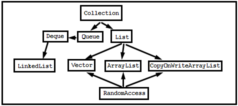

# Lesson 17: Lists

## Введение
**java.util.List** является часть **Java Collection Framework**.
Является интерфейсом, который расширяет интерфейс **Collection**.

List — это упорядоченный список. Объекты хранятся в порядке их добавления в список. Доступ к элементам списка осуществляется по индексу.

В соответствии с Oracle Tutorial: "[The List Interface](https://docs.oracle.com/javase/tutorial/collections/interfaces/list.html)" можно выделить следующие особенности:
- Работа с элементами основываясь на их числовой позиции в списке (на их индексе)
К этому относятся такие методы, как get, set, add, addAll, and remove.
- Обеспечение возможности поиска элемента и возвращение индекса его позиции в списке.
К этому относятся такие методы, как indexOf and lastIndexOf
- Обеспечение получения подсписков (Range-view), которые являются представлением изначального списка.
- Реализация ListIterator'а для двустороннего обхода и выполнения операций вставки и замещения элементов.

## LinkedList
Является двусвязным списком, в котором каждый элемент Node знает про следующий элемент и предыдущий.
Добавление выглядит как создание нового Node и переформирование ссылок в Node.

Хороший обзор представлен тут: "[Структуры данных в картинках. LinkedList](https://habrahabr.ru/post/127864/)"
А так же пункты про LinkedList из обзора "[Собеседование по Java — коллекци](http://javastudy.ru/interview/collections/)".
[LinkedList](http://developer.alexanderklimov.ru/android/java/linkedlist.php)
Количество объектов не ограничивается ничем, только объёмом Heap.

## ArrayList
